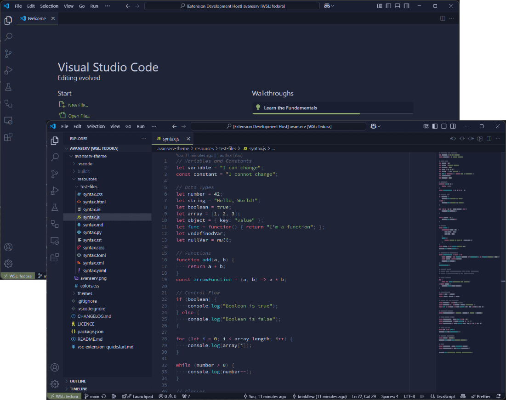

    <h1>
        
         
        Avanserv Theme
    </h1>
    
A Visual Studio Code theme with green accents and pastel colors, designed to be easy on the eyes.

    

## Installation

1. Open the extensions sidebar on Visual Studio Code
1. Search for Avanserv Theme
1. Click Install
1. Click Reload to reload your editor
1. Select the Manage Cog ⚙️ (bottom left) > Color Theme ＞ Avanserv
